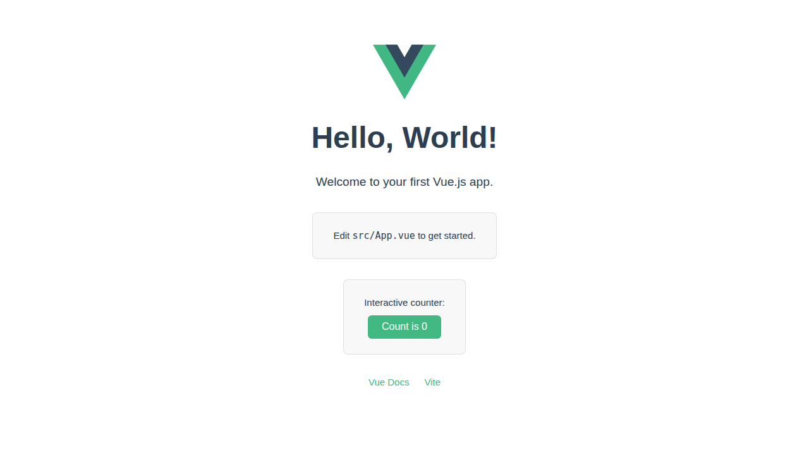

# Hello World · Vue.js

A minimal "Hello World" web app built with [Vue 3](https://vuejs.org/) and [Vite](https://vite.dev/).



## Features

- Vue 3 with the Composition API (`<script setup>`)
- TypeScript
- Vite for fast development and builds
- Interactive counter demonstrating reactive state

## Getting Started

```bash
# Install dependencies
npm install

# Start the development server
npm run dev
```

Open <http://localhost:5173> in your browser.

## Build for Production

```bash
npm run build
```

The production-ready files are output to the `dist/` directory.
